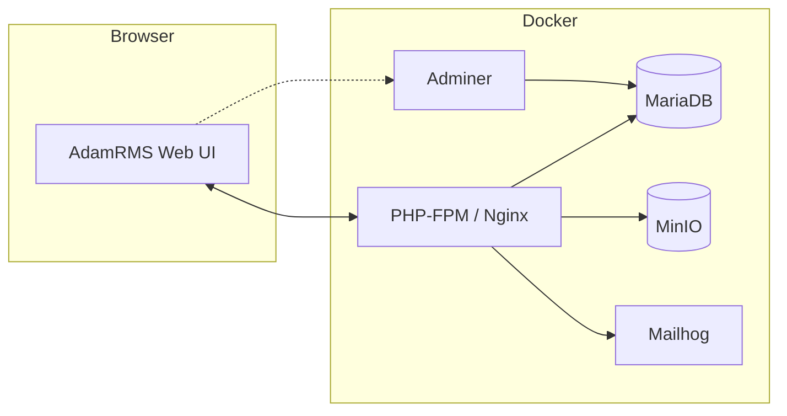

# AdamRMS


AdamRMS is an advanced Rental Management System for Theatre, AV & Broadcast, written in PHP with the Twig Templating engine, and deployed using a pre-built docker container.

It is available as a hosted solution or to be self-hosted as a docker container.

Check out who is using AdamRMS: [stats](https://telemetry.bithell.studio/projects/adam-rms).

See [DEVELOPMENT.md](DEVELOPMENT.md) for a local setup quick start.

## Architecture Overview



## Docker Images

A maintained docker image is provided - hosted on GitHub Packages as [adam-rms/adam-rms](https://github.com/orgs/adam-rms/packages?repo_name=adam-rms). Due to Docker Hub's pricing changes, the Docker Hub images are no longer maintained, but were identical to the GitHub Packages images which are still available to use.

When self-hosting, please pay attention to the license terms of the software you are using. AdamRMS is licenced under AGPLv3, which means changes you make to the source code must be kept open source.

## Getting Started with contributing to this repo

[](https://github.com/codespaces/new?ref=main&repo=217888995)

Thanks for your interest in developing and improving AdamRMS!
Contributions are very welcome - please see [the website](https://adam-rms.com/contributing) for a guide and for more info about this repo.

This repo has a configured devcontainer for use with GitHub Codespaces or VSCode. If you have a GitHub Codespaces subscription (paid), you can use this to get started with the project in the web, or if you have access to VSCode on your computer (free) you can get started by cloning the repo and opening it in VSCode, then [opening the project in a devcontainer](https://code.visualstudio.com/docs/devcontainers/tutorial).

### Running in the Dev Container

Opening the repository in VS Code with the Dev Containers extension (or in GitHub Codespaces) will automatically bootstrap the environment:

- The container image comes with PHP, Composer, and the MySQL client preinstalled for tooling support.
- On first boot the `postCreateCommand` runs `make setup`, which provisions the local Docker services, installs PHP dependencies, and prepares the database.
- Common service ports are forwarded automatically (8080 for the web UI, 8081 for the S3 mock, 8025 for Mailpit, and 9000/9001 for MinIO).

When the stack is running you can toggle Xdebug in the PHP-FPM container from the workspace terminal:

```bash
make xdebug:on   # enable the extension and restart php-fpm
make xdebug:off  # disable the extension and restart php-fpm
```

After enabling Xdebug you can verify it with `php -m | grep xdebug` inside the container. The PHP web server is available at http://localhost:8080/ once the services finish starting.
